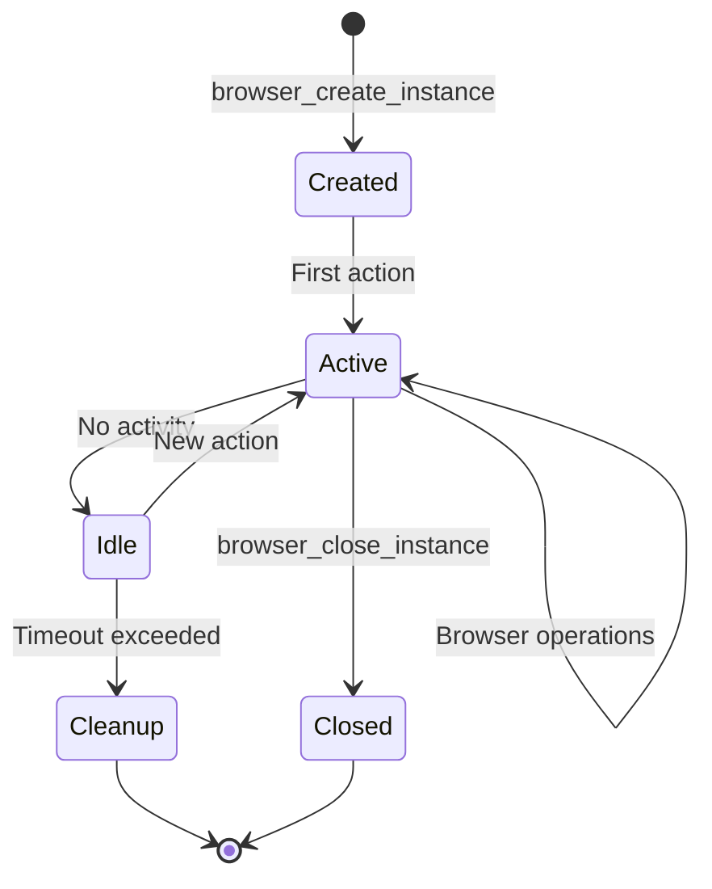

# Concurrent Browser MCP - Detailed Documentation

## Table of Contents
- [What is Concurrent Browser MCP?](#what-is-concurrent-browser-mcp)
- [Core Concepts](#core-concepts)
- [How It Works](#how-it-works)
- [Use Cases](#use-cases)
- [Installation & Setup](#installation--setup)
- [Usage Guide](#usage-guide)
- [Tool Reference](#tool-reference)
- [Advanced Features](#advanced-features)
- [Architecture Deep Dive](#architecture-deep-dive)
- [Troubleshooting](#troubleshooting)

## What is Concurrent Browser MCP?

The Concurrent Browser MCP is a **Model Context Protocol (MCP) server** that enables AI assistants and LLMs to control multiple browser instances simultaneously through a standardized interface. Built on top of Playwright, it provides robust browser automation capabilities with intelligent resource management.

### Key Differentiators

Unlike traditional browser automation tools, this MCP server offers:

- **🚀 True Concurrency**: Run multiple isolated browser instances in parallel
- **🔒 Resource Safety**: Automatic cleanup prevents memory leaks
- **🎯 MCP Integration**: Native support for AI assistants via Model Context Protocol
- **🌐 Multi-Browser Support**: Works with Chromium, Firefox, and WebKit
- **📊 Instance Management**: Track and manage browser lifecycle automatically

## Core Concepts

### Model Context Protocol (MCP)

MCP is a standardized protocol that allows AI assistants to interact with external tools and services. This server implements MCP to expose browser automation capabilities in a way that's easily consumable by LLMs.

### Browser Instances

Each browser instance is an isolated browser environment with:
- Its own browser context (cookies, storage)
- Dedicated page object
- Unique identifier (UUID)
- Metadata for tracking
- Automatic timeout management

### Concurrent Execution Model

The server can manage multiple browser instances simultaneously, allowing:
- Parallel web scraping
- Multi-account testing
- Distributed automation tasks
- Load testing scenarios

## How It Works

### 1. Communication Flow

```
[AI Assistant] <--MCP Protocol--> [Concurrent Browser Server] <--Playwright API--> [Browser Instances]
```

The server acts as a bridge between AI assistants and browser automation:

1. **AI Request**: Assistant sends MCP tool call (e.g., "navigate to website")
2. **Server Processing**: Server validates request and routes to appropriate handler
3. **Browser Action**: Playwright executes the action in the specified browser instance
4. **Response**: Results flow back through MCP to the assistant

### 2. Instance Lifecycle



### 3. Resource Management

The server implements sophisticated resource management:

- **Instance Limits**: Maximum concurrent instances (configurable)
- **Timeout System**: Automatic cleanup of idle instances
- **Graceful Shutdown**: Proper cleanup on server termination
- **Memory Protection**: Prevents resource exhaustion

## Use Cases

### 1. Web Scraping & Data Collection

```javascript
// Create multiple instances for parallel scraping
const instances = await Promise.all([
  createInstance({ name: 'scraper-1' }),
  createInstance({ name: 'scraper-2' }),
  createInstance({ name: 'scraper-3' })
]);

// Scrape different pages simultaneously
await Promise.all(instances.map(async (instance, i) => {
  await navigate(instance.id, `https://example.com/page-${i}`);
  const data = await getPageInfo(instance.id);
  return processData(data);
}));
```

### 2. Automated Testing

- **Multi-browser testing**: Test across Chrome, Firefox, Safari
- **Parallel test execution**: Run test suites concurrently
- **Visual regression testing**: Capture screenshots for comparison
- **Form testing**: Automated form filling and submission

### 3. Web Monitoring

- **Content change detection**: Monitor websites for updates
- **Availability monitoring**: Check site uptime
- **Performance testing**: Measure page load times
- **SEO auditing**: Extract metadata and structure

### 4. AI-Powered Research

- **Information gathering**: Navigate and extract data from multiple sources
- **Comparative analysis**: Load multiple sites for side-by-side comparison
- **Documentation generation**: Convert web content to structured formats
- **Knowledge extraction**: Parse and analyze web content

## Installation & Setup

### Prerequisites

- Node.js 18+ (with npm)
- Operating System: Windows, macOS, or Linux
- Network access for downloading browser binaries

### Installation Methods

#### Method 1: NPM Global Install (Recommended)

```bash
# Install globally
npm install -g concurrent-browser-mcp

# Verify installation
concurrent-browser-mcp --help
```

#### Method 2: Build from Source

```bash
# Clone repository
git clone https://github.com/sailaoda/concurrent-browser-mcp.git
cd concurrent-browser-mcp

# Install dependencies
npm install

# Build TypeScript
npm run build

# Optional: Create global link
npm link
```

### MCP Client Configuration

Add to your MCP client configuration (e.g., Claude Desktop, Cline):

```json
{
  "mcpServers": {
    "concurrent-browser": {
      "command": "npx",
      "args": [
        "concurrent-browser-mcp",
        "--max-instances", "20",
        "--browser", "chromium",
        "--headless", "true"
      ]
    }
  }
}
```

### Command-Line Options

| Option | Description | Default | Example |
|--------|-------------|---------|---------|
| `--max-instances` | Maximum concurrent browsers | 20 | `--max-instances 50` |
| `--instance-timeout` | Idle timeout (minutes) | 30 | `--instance-timeout 60` |
| `--cleanup-interval` | Cleanup check interval (minutes) | 5 | `--cleanup-interval 10` |
| `--browser` | Default browser type | chromium | `--browser firefox` |
| `--headless` | Run browsers in headless mode | true | `--headless false` |
| `--width` | Viewport width | 1280 | `--width 1920` |
| `--height` | Viewport height | 720 | `--height 1080` |
| `--proxy` | Proxy server URL | auto-detect | `--proxy http://localhost:8080` |
| `--user-agent` | Custom user agent | default | `--user-agent "MyBot/1.0"` |

## Usage Guide

### Basic Workflow

1. **Create a Browser Instance**
```javascript
const instance = await callTool('browser_create_instance', {
  browserType: 'chromium',
  headless: false,
  metadata: { name: 'main-browser' }
});
```

2. **Navigate to a Website**
```javascript
await callTool('browser_navigate', {
  instanceId: instance.data.instanceId,
  url: 'https://example.com'
});
```

3. **Interact with the Page**
```javascript
// Click a button
await callTool('browser_click', {
  instanceId: instance.data.instanceId,
  selector: 'button.submit'
});

// Type in an input field
await callTool('browser_type', {
  instanceId: instance.data.instanceId,
  selector: 'input[name="search"]',
  text: 'search query'
});
```

4. **Extract Information**
```javascript
// Get page content
const pageInfo = await callTool('browser_get_page_info', {
  instanceId: instance.data.instanceId
});

// Take a screenshot
const screenshot = await callTool('browser_screenshot', {
  instanceId: instance.data.instanceId,
  fullPage: true
});
```

5. **Clean Up**
```javascript
await callTool('browser_close_instance', {
  instanceId: instance.data.instanceId
});
```

### Advanced Patterns

#### Parallel Processing Pattern

```javascript
async function parallelScrape(urls) {
  // Create instances for each URL
  const instances = await Promise.all(
    urls.map(() => callTool('browser_create_instance', {
      browserType: 'chromium',
      headless: true
    }))
  );

  try {
    // Navigate all instances in parallel
    await Promise.all(
      instances.map((instance, i) => 
        callTool('browser_navigate', {
          instanceId: instance.data.instanceId,
          url: urls[i]
        })
      )
    );

    // Extract data from all pages
    const results = await Promise.all(
      instances.map(instance =>
        callTool('browser_get_page_info', {
          instanceId: instance.data.instanceId
        })
      )
    );

    return results;
  } finally {
    // Always cleanup
    await Promise.all(
      instances.map(instance =>
        callTool('browser_close_instance', {
          instanceId: instance.data.instanceId
        })
      )
    );
  }
}
```

#### Sequential Navigation Pattern

```javascript
async function sequentialBrowsing(instanceId, urls) {
  const results = [];
  
  for (const url of urls) {
    // Navigate to each URL
    await callTool('browser_navigate', {
      instanceId,
      url,
      waitUntil: 'networkidle'
    });
    
    // Wait for specific element
    await callTool('browser_wait_for_element', {
      instanceId,
      selector: '.content-loaded',
      timeout: 10000
    });
    
    // Extract data
    const data = await callTool('browser_get_markdown', {
      instanceId
    });
    
    results.push({ url, data });
  }
  
  return results;
}
```

## Tool Reference

### Instance Management Tools

#### `browser_create_instance`
Creates a new browser instance with specified configuration.

**Parameters:**
- `browserType` (optional): 'chromium' | 'firefox' | 'webkit'
- `headless` (optional): boolean
- `viewport` (optional): { width: number, height: number }
- `userAgent` (optional): string
- `proxy` (optional): { server: string }
- `metadata` (optional): { name?: string, tags?: string[], description?: string }

**Returns:**
```javascript
{
  success: true,
  data: {
    instanceId: "uuid-string",
    createdAt: "2024-01-01T00:00:00Z"
  }
}
```

#### `browser_list_instances`
Lists all active browser instances.

**Returns:**
```javascript
{
  success: true,
  data: {
    instances: [
      {
        id: "uuid-string",
        browserType: "chromium",
        createdAt: "2024-01-01T00:00:00Z",
        lastUsed: "2024-01-01T00:05:00Z",
        isActive: true,
        metadata: { name: "scraper-1" }
      }
    ],
    count: 1
  }
}
```

### Navigation Tools

#### `browser_navigate`
Navigates to a specified URL.

**Parameters:**
- `instanceId`: string (required)
- `url`: string (required)
- `waitUntil`: 'load' | 'domcontentloaded' | 'networkidle' (optional)
- `timeout`: number in ms (optional)

### Page Interaction Tools

#### `browser_click`
Clicks on an element.

**Parameters:**
- `instanceId`: string (required)
- `selector`: string (required)
- `button`: 'left' | 'right' | 'middle' (optional)
- `clickCount`: number (optional)
- `delay`: number in ms (optional)

#### `browser_type`
Types text into an element.

**Parameters:**
- `instanceId`: string (required)
- `selector`: string (required)
- `text`: string (required)
- `delay`: number in ms between keystrokes (optional)

#### `browser_fill`
Fills a form field (faster than typing).

**Parameters:**
- `instanceId`: string (required)
- `selector`: string (required)
- `value`: string (required)

### Information Extraction Tools

#### `browser_get_page_info`
Gets comprehensive page information.

**Returns:**
```javascript
{
  success: true,
  data: {
    url: "https://example.com",
    title: "Page Title",
    html: "<html>...</html>",
    stats: {
      images: 10,
      links: 25,
      scripts: 5,
      stylesheets: 3,
      forms: 2,
      inputs: 8
    },
    metadata: {
      description: "Page description",
      keywords: "keyword1, keyword2",
      author: "Author Name",
      ogTitle: "Open Graph Title",
      ogDescription: "OG Description",
      ogImage: "https://example.com/image.jpg"
    }
  }
}
```

#### `browser_screenshot`
Takes a screenshot of the page.

**Parameters:**
- `instanceId`: string (required)
- `fullPage`: boolean (optional)
- `selector`: string (optional) - screenshot specific element

**Returns:**
```javascript
{
  success: true,
  data: {
    screenshot: "base64-encoded-image-data"
  }
}
```

#### `browser_get_markdown`
Converts page content to clean Markdown format.

**Returns:**
```javascript
{
  success: true,
  data: {
    markdown: "# Page Title\n\nContent in markdown format...",
    title: "Page Title",
    url: "https://example.com"
  }
}
```

### Wait Operations

#### `browser_wait_for_element`
Waits for an element to appear.

**Parameters:**
- `instanceId`: string (required)
- `selector`: string (required)
- `timeout`: number in ms (optional, default: 30000)
- `state`: 'attached' | 'detached' | 'visible' | 'hidden' (optional)

#### `browser_wait_for_navigation`
Waits for navigation to complete.

**Parameters:**
- `instanceId`: string (required)
- `timeout`: number in ms (optional)
- `waitUntil`: 'load' | 'domcontentloaded' | 'networkidle' (optional)

### JavaScript Execution

#### `browser_evaluate`
Executes JavaScript in the page context.

**Parameters:**
- `instanceId`: string (required)
- `script`: string (required) - JavaScript code to execute

**Example:**
```javascript
await callTool('browser_evaluate', {
  instanceId: 'abc123',
  script: `
    document.querySelectorAll('a').length
  `
});
```

## Advanced Features

### Proxy Configuration

The server supports sophisticated proxy configuration with auto-detection:

#### Auto-Detection (Default)
The server automatically detects proxies in this order:
1. Environment variables: `HTTP_PROXY`, `HTTPS_PROXY`, `ALL_PROXY`
2. Common proxy ports: 7890, 1087, 8080, 3128, 8888
3. System proxy settings (macOS)

#### Manual Configuration
```bash
# Specify proxy via command line
concurrent-browser-mcp --proxy http://localhost:8080

# Or in MCP configuration
{
  "args": ["--proxy", "socks5://localhost:1080"]
}
```

#### Disable Auto-Detection
```bash
concurrent-browser-mcp --no-proxy-auto-detect
```

### Resource Management

#### Instance Limits
Prevent resource exhaustion:
```bash
concurrent-browser-mcp --max-instances 50
```

#### Timeout Configuration
Automatic cleanup of idle instances:
```bash
# Set 60-minute timeout for idle instances
concurrent-browser-mcp --instance-timeout 60

# Check for cleanup every 10 minutes
concurrent-browser-mcp --cleanup-interval 10
```

#### Memory Management
The server implements several memory-saving strategies:
- Automatic cleanup of timed-out instances
- Graceful shutdown on SIGINT/SIGTERM
- Resource pooling for efficient reuse
- Isolated contexts prevent memory leaks

### Browser Configuration

#### Multi-Browser Support
```javascript
// Create different browser types
await callTool('browser_create_instance', {
  browserType: 'firefox'  // or 'webkit' for Safari engine
});
```

#### Custom User Agents
```javascript
await callTool('browser_create_instance', {
  userAgent: 'MyBot/1.0 (compatible; MyCompany)'
});
```

#### Viewport Control
```javascript
await callTool('browser_create_instance', {
  viewport: {
    width: 1920,
    height: 1080
  }
});
```

### Error Handling

The server provides comprehensive error handling:

```javascript
try {
  const result = await callTool('browser_navigate', {
    instanceId: 'invalid-id',
    url: 'https://example.com'
  });
} catch (error) {
  // Error structure:
  // {
  //   success: false,
  //   error: "Browser instance not found: invalid-id"
  // }
}
```

Common error scenarios:
- Instance not found
- Maximum instances exceeded
- Navigation timeout
- Element not found
- Invalid selector
- JavaScript evaluation errors

## Architecture Deep Dive

### Component Architecture

```
┌──────────────────────────────────────────────────────┐
│                   MCP Client Layer                    │
│  (Claude Desktop, Cline, Custom Clients)             │
└────────────────┬─────────────────────────────────────┘
                 │ MCP Protocol (JSON-RPC over stdio)
┌────────────────▼─────────────────────────────────────┐
│              ConcurrentBrowserServer                  │
│  ┌─────────────────────────────────────────────────┐ │
│  │            Request Handler                      │ │
│  │  - Protocol parsing                            │ │
│  │  - Request validation                          │ │
│  │  - Response formatting                         │ │
│  └─────────────────┬───────────────────────────────┘ │
│                    │                                  │
│  ┌─────────────────▼───────────────────────────────┐ │
│  │            BrowserTools                         │ │
│  │  - Tool definitions                            │ │
│  │  - Parameter validation                        │ │
│  │  - Operation execution                         │ │
│  └─────────────────┬───────────────────────────────┘ │
│                    │                                  │
│  ┌─────────────────▼───────────────────────────────┐ │
│  │           BrowserManager                        │ │
│  │  - Instance lifecycle                          │ │
│  │  - Resource allocation                         │ │
│  │  - Cleanup scheduler                           │ │
│  └─────────────────┬───────────────────────────────┘ │
└────────────────────┼─────────────────────────────────┘
                     │
┌────────────────────▼─────────────────────────────────┐
│                  Playwright Layer                     │
│  ┌──────────┐  ┌──────────┐  ┌──────────┐          │
│  │ Browser 1│  │ Browser 2│  │ Browser N│          │
│  │          │  │          │  │          │          │
│  │ Context  │  │ Context  │  │ Context  │          │
│  │   Page   │  │   Page   │  │   Page   │          │
│  └──────────┘  └──────────┘  └──────────┘          │
└──────────────────────────────────────────────────────┘
```

### Data Flow

1. **Request Phase**
   - MCP client sends JSON-RPC request via stdio
   - Server parses and validates request
   - Routes to appropriate tool handler

2. **Execution Phase**
   - Tool handler validates parameters
   - BrowserManager provides instance access
   - Playwright executes browser operation

3. **Response Phase**
   - Operation result captured
   - Error handling if needed
   - JSON-RPC response sent back

### Concurrency Model

The server uses Node.js's event-driven architecture:

- **Non-blocking I/O**: All browser operations are async
- **Event Loop**: Handles multiple requests concurrently
- **Promise-based**: Clean async/await patterns throughout
- **Resource Pooling**: Efficient browser instance reuse

### Security Considerations

- **Input Validation**: All parameters are validated
- **Sandbox Isolation**: Each browser context is isolated
- **Resource Limits**: Prevents DoS through instance limits
- **Proxy Support**: Enables secure browsing through proxies
- **No Direct Code Execution**: Only predefined operations

## Troubleshooting

### Common Issues

#### 1. Browser Download Fails
```bash
# Manually install browsers
npx playwright install chromium firefox webkit
```

#### 2. Permission Errors
```bash
# Fix permissions on Unix-like systems
chmod +x node_modules/.bin/concurrent-browser-mcp
```

#### 3. Proxy Connection Issues
```bash
# Test proxy connectivity
curl -x http://your-proxy:port https://example.com

# Disable proxy auto-detection if causing issues
concurrent-browser-mcp --no-proxy-auto-detect
```

#### 4. Memory Issues
```bash
# Reduce instance limits
concurrent-browser-mcp --max-instances 5

# Decrease timeout for faster cleanup
concurrent-browser-mcp --instance-timeout 10
```

#### 5. MCP Connection Errors
Check your MCP client configuration:
- Ensure correct command path
- Verify Node.js is in PATH
- Check for conflicting server names

### Debug Mode

Enable verbose logging:
```bash
# Set debug environment variable
DEBUG=* concurrent-browser-mcp
```

### Performance Tuning

#### For Web Scraping
```bash
concurrent-browser-mcp \
  --max-instances 50 \
  --headless true \
  --instance-timeout 5 \
  --cleanup-interval 2
```

#### For Testing
```bash
concurrent-browser-mcp \
  --max-instances 10 \
  --headless false \
  --width 1920 \
  --height 1080 \
  --instance-timeout 60
```

#### For Development
```bash
concurrent-browser-mcp \
  --max-instances 3 \
  --headless false \
  --browser chromium \
  --no-proxy-auto-detect
```

## Best Practices

### 1. Always Clean Up Resources
```javascript
const instanceId = await createInstance();
try {
  // Your automation code
} finally {
  await closeInstance(instanceId);
}
```

### 2. Use Appropriate Wait Strategies
```javascript
// For SPA applications
await navigate(instanceId, url, { waitUntil: 'networkidle' });

// For static pages
await navigate(instanceId, url, { waitUntil: 'domcontentloaded' });
```

### 3. Handle Errors Gracefully
```javascript
const result = await callTool('browser_click', params);
if (!result.success) {
  console.error('Click failed:', result.error);
  // Implement retry logic or alternative approach
}
```

### 4. Optimize for Concurrency
```javascript
// Good: Parallel execution
await Promise.all(urls.map(url => processUrl(url)));

// Avoid: Sequential when parallel is possible
for (const url of urls) {
  await processUrl(url);
}
```

### 5. Use Metadata for Organization
```javascript
await createInstance({
  metadata: {
    name: 'scraper-product-pages',
    tags: ['production', 'scraping'],
    description: 'Scrapes product information'
  }
});
```

## Contributing

Contributions are welcome! Please:

1. Fork the repository
2. Create a feature branch
3. Make your changes
4. Add tests if applicable
5. Submit a pull request

## License

MIT License - see LICENSE file for details

## Support

- **GitHub Issues**: [Report bugs or request features](https://github.com/sailaoda/concurrent-browser-mcp/issues)
- **Documentation**: This comprehensive guide
- **Examples**: Check the `examples/` directory

---

*Built with ❤️ using Playwright and Model Context Protocol*