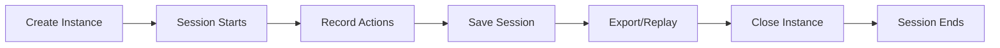

# Session Recording & Replay Documentation

## Overview

The concurrent-browser-mcp now includes comprehensive **session recording and replay functionality** that captures all browser actions as JSON data. This enables:

- 📼 **Complete action recording** - Every browser interaction is logged
- 🔄 **Session replay** - Recreate exact browser sessions from recordings
- 📊 **Action analytics** - Analyze patterns and debug automation flows
- 💾 **Persistent storage** - Save and load sessions for later use
- 🎭 **Script generation** - Export sessions as Playwright scripts

## How It Works

### Session Lifecycle



1. **Automatic Start**: Sessions begin when a browser instance is created
2. **Action Capture**: All MCP tool calls are recorded with parameters and results
3. **JSON Storage**: Actions are stored as structured JSON data
4. **Replay Capability**: Sessions can be replayed on new browser instances

### Session Data Structure

Each session contains:

```json
{
  "id": "unique-session-id",
  "instanceId": "browser-instance-id",
  "browserType": "chromium|firefox|webkit",
  "startedAt": "2024-01-01T00:00:00Z",
  "endedAt": "2024-01-01T00:10:00Z",
  "actions": [
    {
      "id": "action-id",
      "timestamp": "2024-01-01T00:00:01Z",
      "tool": "browser_navigate",
      "parameters": {
        "instanceId": "...",
        "url": "https://example.com"
      },
      "result": { "success": true },
      "duration": 1234
    }
  ],
  "metadata": {
    "name": "test-session",
    "description": "Testing session recording",
    "tags": ["test", "demo"]
  },
  "config": {
    "headless": false,
    "viewport": { "width": 1280, "height": 720 },
    "userAgent": "custom-agent"
  }
}
```

## Configuration

### Enable Session Recording

Session recording is **enabled by default**. Configure it via server options:

```javascript
const config = {
  sessionRecording: {
    enabled: true,        // Enable/disable recording
    autoSave: true,       // Auto-save sessions to disk
    sessionsDir: './sessions'  // Directory for session files
  }
};
```

### Command Line Options

```bash
# Enable session recording (default)
concurrent-browser-mcp --session-recording

# Disable session recording
concurrent-browser-mcp --no-session-recording

# Custom sessions directory
concurrent-browser-mcp --sessions-dir /path/to/sessions
```

## MCP Tools for Session Management

### Core Session Tools

#### `session_get_current`
Get the current session for a browser instance.

```javascript
{
  "tool": "session_get_current",
  "parameters": {
    "instanceId": "abc-123"
  }
}
// Returns: Complete session object with all recorded actions
```

#### `session_list_all`
List all active sessions in memory.

```javascript
{
  "tool": "session_list_all",
  "parameters": {}
}
// Returns: Array of all active sessions
```

#### `session_save`
Save a session to disk for persistence.

```javascript
{
  "tool": "session_save",
  "parameters": {
    "instanceId": "abc-123"
  }
}
// Returns: { "filepath": "/path/to/session_file.json" }
```

#### `session_export`
Export session as JSON or Playwright script.

```javascript
{
  "tool": "session_export",
  "parameters": {
    "instanceId": "abc-123",
    "format": "json" // or "playwright"
  }
}
// Returns: Exported content as string
```

#### `session_replay`
Replay a saved session on a new browser instance.

```javascript
{
  "tool": "session_replay",
  "parameters": {
    "filepath": "/path/to/session.json"
  }
}
// Returns: { "instanceId": "new-instance-id" }
```

#### `session_get_stats`
Get statistics about a session.

```javascript
{
  "tool": "session_get_stats",
  "parameters": {
    "instanceId": "abc-123"
  }
}
// Returns: {
//   "totalActions": 15,
//   "duration": 60000,
//   "toolUsage": {
//     "browser_navigate": 3,
//     "browser_click": 5,
//     "browser_type": 7
//   },
//   "errorCount": 0
// }
```

#### `session_toggle_recording`
Enable or disable session recording globally.

```javascript
{
  "tool": "session_toggle_recording",
  "parameters": {
    "enabled": false
  }
}
```

## Usage Examples

### Example 1: Basic Session Recording

```javascript
// 1. Create instance (starts recording)
const instance = await callTool('browser_create_instance', {
  metadata: { name: 'shopping-session' }
});

// 2. Perform actions (all recorded)
await callTool('browser_navigate', {
  instanceId: instance.data.instanceId,
  url: 'https://shop.example.com'
});

await callTool('browser_click', {
  instanceId: instance.data.instanceId,
  selector: '.product-link'
});

// 3. Save session
const saved = await callTool('session_save', {
  instanceId: instance.data.instanceId
});

console.log(`Session saved to: ${saved.data.filepath}`);
```

### Example 2: Replay a Session

```javascript
// Load and replay a previous session
const replay = await callTool('session_replay', {
  filepath: './sessions/session_2024-01-01.json'
});

// The new instance will automatically execute all recorded actions
console.log(`Replaying on instance: ${replay.data.instanceId}`);
```

### Example 3: Export as Playwright Script

```javascript
// Export session as executable Playwright code
const script = await callTool('session_export', {
  instanceId: 'abc-123',
  format: 'playwright'
});

// Save the script to a file
fs.writeFileSync('replay-script.js', script.data.content);
```

Generated script example:
```javascript
// Generated Playwright script from session abc-123
// Created: 2024-01-01T00:00:00Z

import { chromium } from 'playwright';

async function replay() {
  const browser = await chromium.launch({
    headless: false
  });
  
  const context = await browser.newContext({
    viewport: { width: 1280, height: 720 }
  });
  
  const page = await context.newPage();
  
  await page.goto('https://example.com');
  await page.click('button.submit');
  await page.type('input[name="search"]', 'test query');
  await page.screenshot({ fullPage: true });
  
  await browser.close();
}

replay();
```

### Example 4: Session Analytics

```javascript
// Get session statistics
const stats = await callTool('session_get_stats', {
  instanceId: 'abc-123'
});

console.log(`Total actions: ${stats.data.totalActions}`);
console.log(`Session duration: ${stats.data.duration}ms`);
console.log(`Most used tool: ${Object.entries(stats.data.toolUsage)
  .sort((a, b) => b[1] - a[1])[0][0]}`);
```

## Use Cases

### 1. Debugging Automation Flows

Record a problematic session and analyze the exact sequence of actions:

```javascript
// Record the session
const session = await callTool('session_get_current', { instanceId });

// Find where the error occurred
const failedAction = session.data.actions.find(a => a.error);
console.log('Failed at:', failedAction);
```

### 2. Test Case Generation

Convert manual browser sessions into automated tests:

1. Manually navigate through your application
2. Export the session as a Playwright script
3. Add assertions to create a complete test

### 3. Performance Analysis

Analyze action timings to identify bottlenecks:

```javascript
const session = await callTool('session_get_current', { instanceId });

const slowActions = session.data.actions
  .filter(a => a.duration > 5000)
  .map(a => ({
    tool: a.tool,
    duration: a.duration,
    params: a.parameters
  }));

console.log('Slow actions:', slowActions);
```

### 4. Training Data Collection

Collect browser interaction patterns for ML training:

```javascript
// Collect multiple sessions
const sessions = await callTool('session_list_saved', {});

// Extract interaction patterns
const patterns = sessions.data.sessions.map(s => ({
  sequence: s.session.actions.map(a => a.tool),
  outcomes: s.session.actions.map(a => a.result?.success)
}));
```

### 5. Compliance and Auditing

Keep records of all browser automation activities:

```javascript
// Auto-save all sessions with metadata
const instance = await callTool('browser_create_instance', {
  metadata: {
    name: 'compliance-check',
    tags: ['audit', 'q4-2024'],
    description: 'Quarterly compliance verification'
  }
});

// All actions are automatically recorded and saved
```

## Best Practices

### 1. Session Naming

Use descriptive metadata for easy identification:

```javascript
await callTool('browser_create_instance', {
  metadata: {
    name: `test-${Date.now()}`,
    description: 'Login flow test',
    tags: ['test', 'login', 'production']
  }
});
```

### 2. Error Handling

Sessions record both successes and failures:

```javascript
const stats = await callTool('session_get_stats', { instanceId });
if (stats.data.errorCount > 0) {
  const session = await callTool('session_get_current', { instanceId });
  const errors = session.data.actions.filter(a => a.error);
  console.log('Errors found:', errors);
}
```

### 3. Storage Management

Regularly clean up old session files:

```javascript
const sessions = await callTool('session_list_saved', {});
const oldSessions = sessions.data.sessions.filter(s => {
  const age = Date.now() - new Date(s.session.startedAt).getTime();
  return age > 7 * 24 * 60 * 60 * 1000; // 7 days
});

// Delete old sessions
for (const session of oldSessions) {
  fs.unlinkSync(session.filepath);
}
```

### 4. Sensitive Data

The session recorder automatically sanitizes sensitive fields:

- Passwords are replaced with `***REDACTED***`
- API keys and tokens are hidden
- Large data (screenshots, HTML) is truncated

### 5. Performance Considerations

- Sessions are kept in memory for 1 minute after closing
- Auto-save writes to disk asynchronously
- Large sessions may impact memory usage
- Consider disabling recording for high-volume operations

## Troubleshooting

### Session Not Recording

Check if recording is enabled:
```javascript
const result = await callTool('session_toggle_recording', { enabled: true });
```

### Replay Failures

Common causes:
- Changed website structure
- Missing elements
- Network issues
- Timing differences

Solution: Add wait conditions and error handling to replay logic.

### Storage Issues

Ensure sessions directory exists and is writable:
```bash
mkdir -p ./sessions
chmod 755 ./sessions
```

### Memory Usage

For long-running sessions:
```javascript
// Periodically save and clear
await callTool('session_save', { instanceId });
// Session is still recorded but memory is optimized
```

## Advanced Features

### Custom Action Metadata

Actions can include custom metadata:

```javascript
// When implementing custom tools, include metadata
await recordAction(instanceId, {
  tool: 'custom_action',
  parameters: { /* ... */ },
  metadata: {
    category: 'form-interaction',
    importance: 'high',
    custom_field: 'value'
  }
});
```

### Session Comparison

Compare two sessions to find differences:

```javascript
function compareSessions(session1, session2) {
  const tools1 = session1.actions.map(a => a.tool);
  const tools2 = session2.actions.map(a => a.tool);
  
  const differences = tools1.filter((tool, i) => tool !== tools2[i]);
  return differences;
}
```

### Selective Replay

Replay only specific actions:

```javascript
const session = await callTool('session_load', { filepath });
const navigateActions = session.data.actions.filter(
  a => a.tool === 'browser_navigate'
);

// Replay only navigation actions
for (const action of navigateActions) {
  await callTool(action.tool, action.parameters);
}
```

## Integration with CI/CD

### GitHub Actions Example

```yaml
name: Replay Browser Sessions
on: [push]

jobs:
  replay:
    runs-on: ubuntu-latest
    steps:
      - uses: actions/checkout@v2
      
      - name: Setup Node.js
        uses: actions/setup-node@v2
        with:
          node-version: '18'
      
      - name: Install dependencies
        run: npm install -g concurrent-browser-mcp
      
      - name: Replay test sessions
        run: |
          for session in ./sessions/*.json; do
            npx concurrent-browser-mcp replay "$session"
          done
```

## API Reference

### SessionRecorder Class

```typescript
class SessionRecorder {
  constructor(options: {
    recordingEnabled?: boolean;
    autoSave?: boolean;
    sessionsDir?: string;
  });
  
  startSession(instanceId: string, config: any): Promise<string>;
  recordAction(instanceId: string, action: ActionRecord): Promise<void>;
  endSession(instanceId: string): Promise<void>;
  getSession(instanceId: string): Session | undefined;
  saveSession(instanceId: string): Promise<string>;
  loadSession(filepath: string): Promise<Session>;
  exportAsScript(instanceId: string, format: 'json' | 'playwright'): Promise<string>;
  replaySession(session: Session | string, browserManager: any): Promise<ReplayResult>;
}
```

### Session Types

```typescript
interface Session {
  id: string;
  instanceId: string;
  browserType: string;
  startedAt: string;
  endedAt?: string;
  actions: ActionRecord[];
  metadata?: any;
  config?: any;
}

interface ActionRecord {
  id: string;
  timestamp: string;
  tool: string;
  parameters: any;
  result?: any;
  error?: string;
  duration?: number;
  metadata?: any;
}
```

## Summary

Session recording transforms the concurrent-browser-mcp into a powerful tool for:

- **Development**: Debug and understand browser automation flows
- **Testing**: Generate and replay test scenarios
- **Analysis**: Understand user interaction patterns
- **Compliance**: Maintain audit trails of automated activities
- **Learning**: Study and share automation techniques

The JSON-based recording format ensures sessions are portable, analyzable, and replayable across different environments, making browser automation more transparent and maintainable.